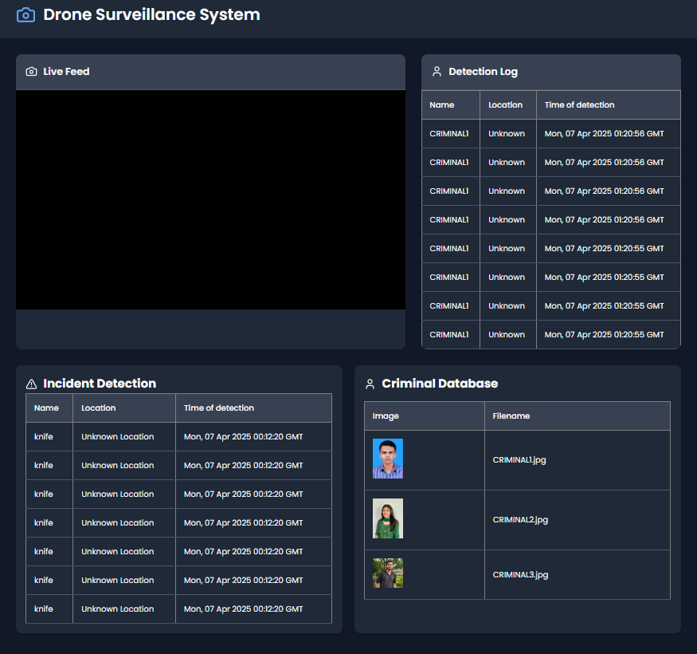

# Drone Surveillance System 🚁🔍

A real-time drone-based surveillance system powered by computer vision, designed to detect criminals ,weapons and accident activities, track individuals using SORT, and identify known criminals using face recognition models.

---

## 🔧 Features

- 🎥 **Live Video Feed** from drone camera.
- 🧠 **YOLOv8 Detection** for criminal,weapon and accident activity.
- 🧑‍💼 **Face Detection** with CNN facedetector.
- 🧠 **Face Recognition** using dlib with ResNet.
- 🔁 **SORT (Simple Online Realtime Tracking)** for tracking faces.
- 📸 **Face Embedding Storage** and cosine similarity comparison.
- 🗃️ **Detection Logs** stored in MySQL.
- 🖼️ **Dynamic Criminal Database Display** (max 3 shown, rest scrollable).
- 🧠 **Real-time incident alert** system on dashboard.
- 🖥️ **Modern Web Interface** with live updates.

---

## 🖼️ Project Structure

```
Sentinel_Eye/
├── app1.py                         # Main Flask app: connects frontend, YOLO, face recognition
├── face_rec.py                    # Handles face recognition logic using dlib
├── processor1.py                  # YOLO-based detection and image/frame processing
├── requirements.txt               # Python dependencies
├── LICENSE                        # MIT License

├── face-recognition.js-models/    # Face recognition models & related assets
│   └── models/
│       ├── dlib_face_recognition_resnet_model_v1.dat        # dlib ResNet face encoder
│       ├── mmod_human_face_detector.dat                     # CNN-based face detector
│       ├── shape_predictor_5_face_landmarks.dat             # Lightweight landmark predictor
│       ├── shape_predictor_68_face_landmarks.dat            # 68-point landmark predictor
│       └── shape_predictor_68_face_landmarks_GTX.dat        # Optimized 68-landmark model (for GTX GPUs)

├── static/                        # Static files for frontend
│   ├── criminals/                 # Folder with known criminal face images
│   ├── script.js                  # Frontend behavior (e.g., video stream, detection updates)
│   └── style.css                  # CSS styling for the interface

├── templates/
│   └── index.html                 # Web interface (Jinja2 template) served by Flask

├── YOLO_MODELS/                   # YOLOv8 object detection models
│   ├── best.pt                    # General-purpose YOLOv8 model
│   └── NICEONE/
│       └── best1.pt               # Specialized YOLOv8 model (custom trained)
```

---

## ⚙️ Setup Instructions

### 1. Clone the Repository

```bash
git clone https://github.com/JIKS31/Sentinel-Eye.git
cd Sentinel-Eye
```

### 2. Create Virtual Environment

```bash
python -m venv venv
source venv/bin/activate   # On Windows use: venv\Scripts\activate
```

### 3. Install Dependencies

```bash
pip install -r requirements.txt
```

### 4. Start the Application

```bash
python app1.py
```

Visit `http://127.0.0.1:5000` in your browser.

---

## 💡 Technologies Used

- **YOLOv8** (Ultralytics) – Accident & Weapon detection.
- **CNN-Face detector** – Face detection.
- **dlib (ResNet_v1)** – Face recognition via embeddings.
- **SORT** – Object tracking.
- **MySQL** – Storage for detected logs.
- **Flask** – Backend framework.
- **HTML + CSS + JS** – Frontend UI.

---

## 📸 Preview

Live feed with real-time detection logs and alerts.



---

## 🛠️ Future Contributions

We are actively seeking contributors! Planned enhancements:

- ✅ DeepSORT for improved tracking with appearance features.
- ✅ RetinaFace + ArcFace/Dlib for high-accuracy recognition.
- ✅ Multi-GPU parallel inference support.
- ✅ Admin dashboard for criminal profile management.
- ✅ Location tracking and sending to admins.
---

## 🤝 Contributing

1. Fork this repository.
2. Create your branch: `git checkout -b feature-name`
3. Commit your changes: `git commit -am 'Add new feature'`
4. Push to the branch: `git push origin feature-name`
5. Open a Pull Request ✅

---

## 🧑‍💻 Authors

- [JIKSON JIMMY](https://github.com/JIKS31)

---

## 📜 License

This project is licensed under the MIT License.
